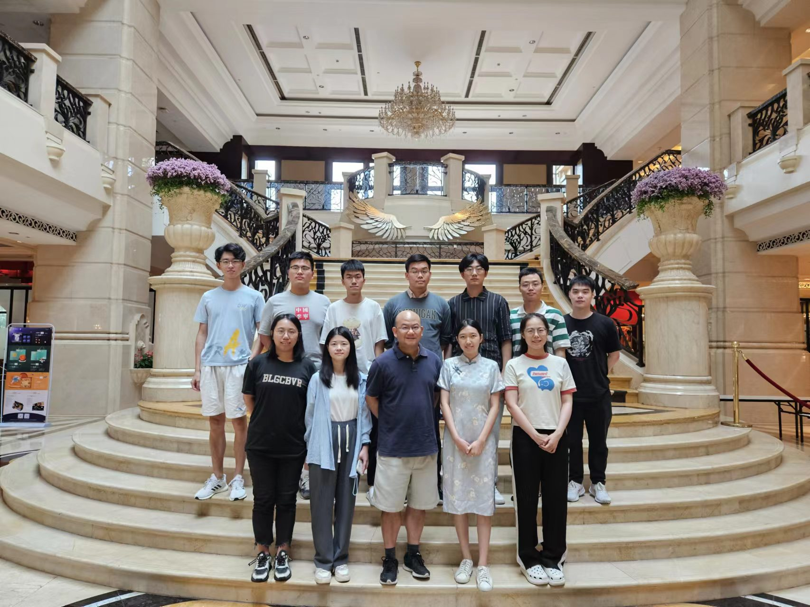

# **Join Us**

## **Prospective Members**
We are always looking for self-motivated [postdoctoral research associates](../assets/pdf/Postdoc.pdf), [Ph.D. students](https://sse-mphil-phd.cuhk.edu.cn/program/CIE) and visiting master/PhD students to join our team. The University and the Shenzhen Municipal Government offer highly competitive compensation. As of 2024/5, each postdoctoral research associate will receive an annual salary of no less than RMB 400,000 while each PhD student RMB 5,000 per month.

**Since the academic year of 2022-2023, ALL PhD students in our team will have reduced or even no teaching duties.**

## **Contact Us**

:fontawesome-solid-map-location: **Address**: 419 Chengdao Building, 2001 Longxiang Road, Longgang District, Shenzhen, China

:fontawesome-solid-envelope: **E-mail**: simonpun[at]cuhk.edu.cn